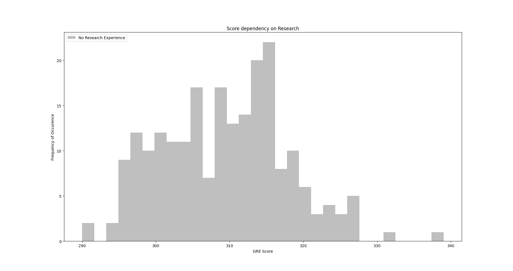

# IIIT-Bombay-student-data-analysis

Here we have some data of IITB students who apply for masters in different university. We analyse it and give answers of some interesting questions.

# QUESTIONS

1) Do GRE and TOEFL scores influence the chance of getting admitted?
2) Does having a Research experience make you score well in GRE and TOEFL?
3) Does the University Rating influence my SOP and LOR rating?
4) What is the average SOP and LOR rating of students who got admitted?
5) How does the University Rating improve the chance of getting admitted?
6) What should be your Scores for 0.9% Chance of Admission?
7) Does research increase your chance of getting admission? 
8) What would you prefer, a high CGPA without research or an average CGPA with research or both for getting admission?
9) Can getting a good Score in GRE give you a high/good LOR?
10) How much effect does LOR Scores have in getting a high ranked university with low CGPA and no Research?

# DATSET OVERVIEW 

This is a dataset that contains parameters that are considered important during the application for Masters Programs and we are gonna analyse it and visualize it whenever required. Our data set has 500 rows and 8 rows. All the entries are in numerical form. 

A glimpse how the data look like :-

|GRE  |TOEFL     |University Rating      |SOP    |LOR   |CGPA       |Research      |Chance of Admit|
| --- | -------- | --------------------- | ----- | ---- | --------- | ------------ | ------------- |
|337  |118       |4                      |4.5    |9.65  |9.65       |1             |0.92           |
|324  |107       |4                      |4.5    |8.87  |8.87       |1             |0.76           |
|316  |104       |3                      |3.5    |8.00  |8.00       |1             |0.72           |
|322  |110       |3                      |2.5    |8.67  |8.67       |1             |0.80           |
|314  |103       |2                      |3.0    |8.21  |8.21       |0             |0.65           |

And other details are below.

Parameters included in the file are :-
1) GRE ( Graduate Record Examination) Score.
    Scores vary from 290 to 340.
2) TOEFL ( Test Of English as a Foregin Language ) Score.
    Scores vary from 92 to 120.
3) University Rating.
    They vary from 1 to 5.
4) SOP ( Statement Of Purpose).
    These are converted to categorical data and range from 1(less effective) to 5 (highly effective).
5) LOR ( Letter of Recommendation).
    These too are converted to categorical data and range from 1 to 5, less powerful to highly recommended once.
6) CGPA
    It’s just the students CGPA.
7) Research Experience.
    This is a binary kind of data. Zero for no research and one for research.
8) Chance of Admit.
    This shows the chance of the student getting admission in the university. It’s between 0 to 1 instead of percentage. And            obviously, closer to one means a high chance of getting admission.

# ANALYSIS
## Question1 
Do GRE and TOEFL scores influence the chance of getting admitted?

Yaah, GRE and TOEFL Score influence the chance of getting an admission directly and this can be seen easily from the data.
Chance of admission varies directly with the GRE Score.

As we can see in the scatter plot with a linear fit line, basically x and y axis are linearly dependent on each other. Data between 310-320 spreads out a lil bit more but still it increases and we will not shy to say that, with a high GRE Score we would have a high Chance of Admission in general.

Also the chance of getting Admission varies directly with TOEFL Score but this time more than the GRE Score.

We can see in the image the slope is 0.018 which is more than the slope of GRE Score(0.010). We can see that the data is more spreaded but still on a general note we can say the TOEFL Score has more influence on Chance of Admission.

Also this can be easily seen below.

So this proper scale image clear all and the one word answer is yes, they do influence.

## Question2
Does having a Research experience make you score well in GRE and TOEFL?

Research experience has a slight influence over GRE and TOEFL Score. Let’s see.
We can see it from stats easily, like 
Group without any Research experience has a average GRE Score of 309.3 
The group with Research experience has an average GRE Score of 322.
In TOEFL this is different, without a Research, score counts to 103.9 .
But with research in TOEFL it increases to 109.7 which is obviously greater but not as increased as seen in GRE Score. 

TOEFL Score of No-Research group :-

TOEFL Score of Research group :-

So we can easily see how high peaks shift to the right side(more TOEFL score) in the Research group.

GRE Score of NO-Research group :-

GRE Score of Research group :- 

Similarly like the TOEFL Score, GRE Score histogram peaks also shift to the right in case of the Research group.

So basically, the one word concrete answer is, yes, research improves scores slightly in general.

## Question 3
Does the University Rating influence my SOP and LOR rating?

So to approach this we're gonna split our data into 5 parts of university rating and then compare their SOP and LOR Score, and that will be mean obviously. And the best thing to see the result in a glance here is Bar charts.
So we will be comparing SOP and LOR Score of same university rated university as we as different rated university :-

Hmm!!! Quite interesting, isn’t it? So basically both SOP and LOR increase with university rating with no exception and both are almost the same in each case.
So the one word answer is, University rating affects your SOP and LOR and  that too positively.

## Question 4
What is the average SOP and LOR rating of students who got admitted?

So First we define “who got admitted”. For this we will define a threshold value of  ‘Chance of Admit’ , say 0.6 for now and all above this will be considered as pass and below as fail. 
After these operations we left with 405 line data instead of the original 500.
So taking these assumptions we see from stats that the minimum of SOP increases from 1.0 to 1.5 and the average decreases from 3.37 to 3.60.
And in the LOR case, the minimum increases from 1 to 1.5 and the average increases from 3.48 to 3.68.
Obviously this all will vary if we change our threshold. But now taking this into consideration, we have the LOR score for admitted group people is higher than the whole group taken into consideration all at same time but strangely SOP score decreases for admitted group than the whole group.
Also we can make one more observation, admitted vs non-admitted:-
So, the average SOP score for admitted increases to 3.60 from 2.41 from non-admitted groups.
And the average LOR score for admitted increases to 3.68 from 2.65 from non-admitted groups.

## Question 5
How does the University Rating improve the chance of getting admitted?

University rating has a very marked effect on chance of getting admission. 
Number of students in each rated university (1, 2, 3, 4, 5)  are (34, 126, 162, 105, 73) respectively. So we can visualize the data from Boxplot of each university rating differently with respect to the Chance of getting Admit.

So we can see easily how the chance of getting admission varies with university rating.
Every box plot has an intersection part with the other block, but in general if we see the IQ range or 50% line, it increases with university rating. 
Hence the general and concrete answer is that university rating increases the chance of getting admission.

## Question 6

What should be your Scores for 0.9% Chance of Admission?

So basically for this we can just focus on the group which is above 0.9 Chance of Admit.
And for this group we can see the stats as following :-

             GRE Score            TOEFL Score       CGPA
count      70.000000           70.000000              70.000000
mean       332.557143          116.200000             9.497857
std        5.235430            2.624301               0.215587
min        320.000000          110.000000             9.060000
25%        330.000000          115.000000             9.352500
50%        332.500000          116.000000             9.465000
75%        336.000000          118.000000             9.660000
max        340.000000          120.000000             9.920000

So the above 0.9 group has an average CGPA of around 9.50 and a GRE Score of 332.56 and an average TOEFL Score of 116.20.
For visualization of Score with such data we can go with Box plots but as we know it’s relation with Chance of Admit ( just greater than 0.9 and nothing more) so we want the distribution of data, hence we will go with histogram. We can draw a single histogram but there are 3 data so it would be a mess so we will draw 3 individual histograms.

Here we can easily see how GRE scores vary for the >0.9 group.

The TOEFL Score has a very high average of 116.2 with a maximum value of 120 and the reason is clear after having a look at the histogram.

The CGPA Score has a high range (9.06, 9.92), and among that we can see the distribution as follows and the average is around 9.5 and also the maximum CGPA this group has.
( In all the above data we have only 70 people remaining for a 0.9 chance of admission, basically not enough data, so we have to adjust the bins accordingly.)
So taking averages into account we can say that you have to score high in all three( because averages are very close to the maximum score) to be sure about  >0.9 chance of admission.

## Question 7
Does research increase your chance of getting admission? 

So to answer this question we can divide our data set into two groups, with research and without research. And for these groups individually we can check the trend of getting admission. 
So for a group of ‘with research’ people we can see the Chance of Getting Admission :-

We can see the major three portions are 0.7 and higher. 

And for the group ‘with no Research’ people we can see the chance of admission as follows.

 Here the two major portions are 0.6 to 0.7 and 0.7 to 0.8 , and a small portion of 0.9 and above people is also there.

So a clear answer after the analysis and visualization is that, yes research increases your chance of Admission.

## Question 8
What would you prefer, a high CGPA without research or an average CGPA with research or both for getting admission?

So first define a ‘high CGPA’ and ‘high chance of admit’. So for now we define high CGPA as 9.0 because in our data 8.57 is the average CGPA, and high chance of admit as >= 0.9, but it can be varied and so the results would be.
So to analyse the situation we first create some groups:
A : Research, low CGPA and high chance of admission.
B : Research, low CGPA and less chance of admission.
C : No Research, high CGPA and high chance of admission.
D : No Research, high CGPA and less chance of admission.
E : Research, high CGPA and high chance of admission.
F : Research, high CGPA and low chance of admission.
So here we are to check the result :- 

Hmm!!! Interesting, isn't it? So this Waffle Chart gives us a clear idea about our question.
There are no A and C categories in the chart, so if you are missing either of Research and CGPA, it definitely gonna affect your chance of admission. Also the major part B tells us that if you lost CGPA you had a great loss. But we have a low D part means if you lost Research, loss is not so great. But the E and F part are almost the same showing that if you have both CGPA and Research, don’t think that you are in heaven, still you have two paths, which are almost equally likely ( that’s because the chance of admission also depends on other things ). 

So finally, we have no one word answer, but a range to analyze.

## Question 9
Can getting a good Score in GRE give you a high/good LOR?

If I score well in GRE, would I get a good LOR? Let’s see.
So to answer this we divide the GRE Score into 10 categories. Like after every 5 marks we have a category. GRE ranges from 290 to 340 so we have in total 10 categories.
So here go :-

Wooh!!!, Isn’t it straight forward, we have nothing to say. Except one glitch the whole graph just looks great, almost linear. So we can comment that GRE scores and a good LOR are directly related to each other.

So one line answer is, yes, you score good in GRE, you have a high chance of getting a good LOR.

## Question 10 
How much effect does LOR Scores have in getting a high ranked university with low CGPA and no Research?

Naah!!! Not so good, is it? Okay so let’s look deeply once, we can see that with a good LOR it has almost all kinds of universities covered and with poor LOR it has a low rating university.

So a one line answer is that if you have no research, low CGPA then a good LOR is not gonna help you much but a bad LOR will definitely land you up in a low rated university.
If you have both a low CGPA and no research, can LOR help you in getting a high ranked university? Let’s see.
So for this we have to analyse low CGPA and no Research group people. And the range of both University ranking and LOR is 1 to 5 so we're gonna draw a Scatter plot to see the effect of LOR on University rating.
